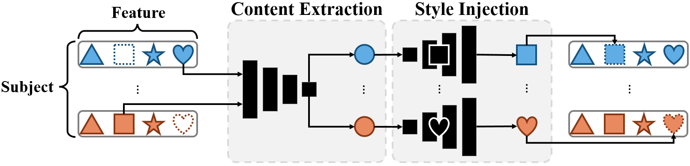

# [ISBI'24 oral] Modality-Agnostic Style Transfer for Holistic Feature Imputation


- This is the official PyTorch implementation of ***Modality-Agnostic Style Transfer for Holistic Feature Imputation.*** [Arxiv](https://arxiv.org/abs/2503.02898) | [IEEE Xplore](https://ieeexplore.ieee.org/document/10635492)

<br/>
<p align="center"></p>

## Abstract
Characterizing a preclinical stage of Alzheimer’s Disease (AD) via single imaging is difficult as its early symptoms are quite subtle. Therefore, many neuroimaging studies are curated with various imaging modalities, e.g., MRI and PET, however, it is often challenging to acquire all of them from all subjects and missing data become inevitable. In this regards, in this paper, we propose a framework that generates unobserved imaging measures for specific subjects using their existing measures, thereby reducing the need for additional examinations. Our framework transfers modality-specific style while preserving AD-specific content. This is done by domain adversarial training that preserves modality-agnostic but AD-specific information, while a generative adversarial network adds an indistinguishable modality-specific style. Our proposed framework is evaluated on the Alzheimer’s Disease Neuroimaging Initiative (ADNI) study and compared with other imputation methods in terms of generated data quality. Small average Cohen’s d < 0.19 between our generated measures and real ones suggests that the synthetic data are practically usable regardless of their modality type.

## Citation
If you find our work useful for your research, please cite the our paper:
```
@inproceedings{baek2024modality,
  title={Modality-Agnostic Style Transfer for Holistic Feature Imputation},
  author={Baek, Seunghun and Sim, Jaeyoon and Dere, Mustafa and Kim, Minjeong and Wu, Guorong and Kim, Won Hwa},
  booktitle={2024 IEEE International Symposium on Biomedical Imaging (ISBI)},
  pages={1--5},
  year={2024},
  organization={IEEE}
}
```
